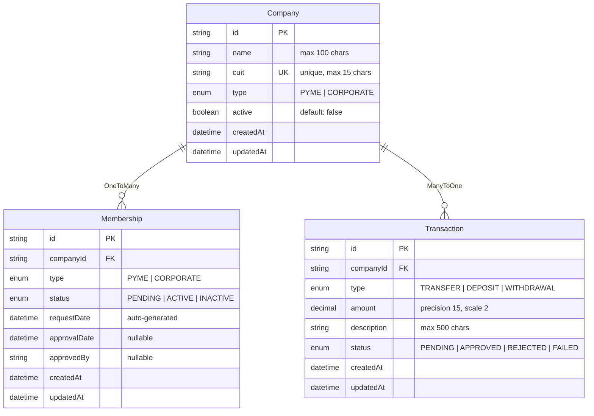

<p align="center">
  
</p>

<p align="center">
  <a href=".github/lambda-architecture.md">
    
  </a>
</p>

> 📋 **[See full analysis of Lambda Function](.github/lambda-architecture.md)** - Architectural justification and integration strategy

# 🚀 Company Membership API

A high-quality [NestJS](https://nestjs.com/) backend service implementing clean architecture with hexagonal pattern, ready to run in development environment with minimal setup.

---

## 📦 Requirements

### Essential
- [Node.js 22.x](https://nodejs.org/en) for local development
- [nvm](https://github.com/nvm-sh/nvm) for Node.js version management

### Recommended VS Code Extensions
- [SQLite Viewer](https://marketplace.visualstudio.com/items?itemName=qwtel.sqlite-viewer) - View and query SQLite databases directly in VS Code
- [REST Client](https://marketplace.visualstudio.com/items?itemName=humao.rest-client) - Test API endpoints using the included `.http` files
- [Mermaid](https://marketplace.visualstudio.com/items?itemName=bierner.markdown-mermaid) - Preview Mermaid diagrams directly in markdown files

> 💡 **Tip**: After installing SQLite Viewer, you can open `./data/db-companies.sqlite` directly in VS Code to inspect the database tables and data.

---

## 🚀 Getting Started

### 1. Clone the repository

```bash
git clone https://github.com/wchopite/company-membership-api.git
cd company-membership-api
```

### 2. Setup Node.js version

```bash
# Use the correct Node.js version
nvm use

# If you don't have Node.js 22.x installed
nvm install 22
nvm use 22
```

### 3. Install dependencies

```bash
npm install
```

### 4. Environment variables

Copy the `.env.example` file to `.env` and update it if needed:

```bash
cp .env.example .env
```

**Example content:**

```env
# Application
NODE_ENV=development
PORT=3000
LOGGER_LEVEL=log

# Database (SQLite)
DB_TYPE=sqlite
DB_PATH=./data/db-companies.sqlite
```

### 5. Seed test data (optional)

Populate the database with test data for easier development:

```bash
npm run seed
```

This creates sample companies, memberships, and transactions with realistic dates for testing the endpoints.

---

## 💻 Running Locally

1. Start the API in development mode:

   ```bash
   npm run start:dev
   ```

2. The API will be available at: `http://localhost:3000/api`

> Make sure you've completed all the setup steps above, including `nvm use` and `npm install`.

---

## 📋 API Endpoints

| Method | Endpoint | Description |
|--------|----------|-------------|
| `POST` | `/companies/membership` | Register a new company membership |
| `GET` | `/companies/recent-memberships` | Get companies that joined in the last month |
| `GET` | `/companies/with-recent-transfers` | Get companies with transfers in the last month |

### Testing with REST Client

The project includes `.http` files for easy endpoint testing with VS Code REST Client extension:

1. Install the [REST Client](https://marketplace.visualstudio.com/items?itemName=humao.rest-client) extension
2. Open any `.http` file in the project
3. Click "Send Request" above any HTTP request

### Example Usage

```bash
# Register a new PYME company
curl -X POST http://localhost:3000/api/companies/membership \
  -H "Content-Type: application/json" \
  -d '{
    "name": "Tech Startup SRL",
    "cuit": "20-12345678-9",
    "type": "PYME"
  }'

# Get recent memberships
curl http://localhost:3000/api/companies/recent-memberships

# Get companies with recent transfers
curl http://localhost:3000/api/companies/with-recent-transfers
```

---

## ⚙️ Useful NPM Scripts

| Command              | Description                               |
| -------------------- | ----------------------------------------- |
| `npm run start:dev`  | Start the app in development mode (watch) |
| `npm run build`      | Compile the app                           |
| `npm run start:prod` | Run compiled code                         |
| `npm run test`       | Run unit tests                            |
| `npm run lint`       | Run linter and auto-fix issues            |
| `npm run seed`       | Populate database with test data          |

---

## 🏗️ Architecture

This API follows **Hexagonal Architecture** (Clean Architecture) principles with clear separation of concerns and business logic isolation.

### Project Structure

```
src/
├── contexts/
│   ├── company/
│   │   ├── domain/          # Entities, enums, exceptions
│   │   ├── application/     # Use cases, DTOs
│   │   └── infra/          # Controllers, repositories
│   └── transaction/
│       ├── domain/
│       ├── application/
│       └── infra/
└── shared/
    ├── database/           # Database configuration & seeding
    ├── logger/            # Logging utilities
    └── services/          # Shared services
```

### Entity Relationship Diagram

> 💡 **Tip**: Copy the code below and paste it into [Mermaid Live Editor](https://mermaid.live/) to view the interactive diagram, or use the [Mermaid](https://marketplace.visualstudio.com/items?itemName=bierner.markdown-mermaid) VS Code extension for inline preview.



> **Note**: The Transaction entity has a `@ManyToOne` relationship to Company, but Company doesn't define the inverse `@OneToMany` relationship to maintain bounded context separation and avoid circular dependencies between modules.

### Architecture Decisions

#### Why Separate Membership Entity?

**Decision**: Membership is a separate entity from Company, not just a boolean flag.

**Rationale**:
- **Business Logic**: A membership has its own lifecycle (pending → active → inactive)
- **Audit Trail**: Track who approved memberships and when
- **Future Extensibility**: Memberships can have different types, renewal dates, or terms
- **Data Integrity**: Separate entity allows for better validation and business rules

```typescript
// Instead of this:
class Company {
  isMember: boolean; // Too simplistic
}

// We have this:
class Membership {
  status: MembershipStatus;    // PENDING, ACTIVE, INACTIVE
  requestDate: Date;           // When they applied
  approvalDate?: Date;         // When approved
  approvedBy?: string;         // Who approved it
}
```

#### Why Domain-Application-Infrastructure Layers?

**Decision**: Strict layer separation following Hexagonal Architecture.

**Benefits**:

1. **Domain Layer** (Business Core)
   - **Pure Business Logic**: No framework dependencies
   - **Testability**: Easy to unit test business rules
   - **Portability**: Can switch frameworks without changing business logic

```typescript
// Pure domain entity with business rules
export class Company {
  activate(): void {
    if (this._active) {
      throw new CompanyAlreadyActiveError(this._id);
    }
    this._active = true;
  }
}
```

2. **Application Layer** (Use Cases)
   - **Orchestration**: Coordinates domain objects and infrastructure
   - **Transaction Management**: Handles cross-entity operations
   - **DTO Mapping**: Clean input/output interfaces

```typescript
// Use case orchestrating business operations
export class RegisterCompanyMembershipUseCase {
  async execute(dto: RegisterMembershipDto): Promise<MembershipCreatedDto> {
    // 1. Validate business rules
    // 2. Create entities
    // 3. Save via repositories
    // 4. Return mapped result
  }
}
```

3. **Infrastructure Layer** (Technical Details)
   - **Framework Integration**: Controllers, TypeORM entities
   - **External Services**: Database, APIs, file system
   - **Dependency Inversion**: Implements domain interfaces

```typescript
// Infrastructure implements domain interface
@Injectable()
export class CompanyRepositoryImpl implements ICompanyRepository {
  // TypeORM specific implementation
}
```

#### Why Conventional Commits?

**Decision**: Use [Conventional Commits](https://www.conventionalcommits.org/) specification for commit messages.

**Format**: `<type>(<scope>): <description>`

**Examples**:
```bash
feat(company): add membership registration endpoint
fix(database): resolve CUIT validation regex
docs(readme): update installation instructions
refactor(domain): extract membership validation logic
test(membership): add unit tests for approval workflow
```

**Benefits**:
- **Automated Changelog**: Generate release notes automatically
- **Semantic Versioning**: Determine version bumps based on commit types
- **Better Collaboration**: Clear communication about change intent
- **Tooling Integration**: Works with automated release pipelines
- **Git History**: Easier to understand project evolution

**Types Used**:
- `feat`: New features
- `fix`: Bug fixes
- `docs`: Documentation changes
- `refactor`: Code refactoring without functional changes
- `test`: Adding or updating tests
- `chore`: Maintenance tasks

#### Why Conventional Commits?

**Decision**: Use [Conventional Commits](https://www.conventionalcommits.org/) specification for commit messages.

**Format**: `<type>(<scope>): <description>`

**Examples**:
```bash
feat(company): add membership registration endpoint
fix(database): resolve CUIT validation regex
docs(readme): update installation instructions
refactor(domain): extract membership validation logic
test(membership): add unit tests for approval workflow
```

**Benefits**:
- **Automated Changelog**: Generate release notes automatically
- **Semantic Versioning**: Determine version bumps based on commit types
- **Better Collaboration**: Clear communication about change intent
- **Tooling Integration**: Works with automated release pipelines
- **Git History**: Easier to understand project evolution

**Types Used**:
- `feat`: New features
- `fix`: Bug fixes
- `docs`: Documentation changes
- `refactor`: Code refactoring without functional changes
- `test`: Adding or updating tests
- `chore`: Maintenance tasks

#### Key Benefits of This Architecture

- **Maintainability**: Changes in one layer don't affect others
- **Testability**: Each layer can be tested in isolation
- **Flexibility**: Easy to swap implementations (SQLite → PostgreSQL)
- **Scalability**: Clear boundaries for team collaboration
- **Domain Focus**: Business logic is protected from technical concerns

#### Trade-offs

- **Complexity**: More files and abstractions than a simple CRUD API
- **Learning Curve**: Developers need to understand the architecture
- **Initial Development**: Takes longer to set up than a monolithic approach

**Why It's Worth It**: For business applications, the long-term benefits of maintainability, testability, and clear business logic separation outweigh the initial complexity cost.

---

## 🔮 Future Improvements

This section outlines potential enhancements that would make the API production-ready:

### 🛡️ Error Handling & Response Standardization

**Current State**: Basic exception handling
**Improvement**: Implement a global exception filter

```typescript
// Standardized error response format
{
  "success": false,
  "error": {
    "code": "VALIDATION_ERROR",
    "message": "Invalid CUIT format",
    "details": {
      "field": "cuit",
      "value": "123456"
    }
  },
  "timestamp": "2024-01-15T10:30:00Z",
  "path": "/api/companies/membership"
}
```

**Benefits**: Consistent error responses, better frontend integration, improved debugging

### 🔐 Authentication & Authorization

**Current State**: Open endpoints
**Improvement**: JWT-based authentication module

- **User Management**: Registration, login, profile management
- **JWT Guards**: Protect sensitive endpoints

**Example Protected Endpoints**:
```typescript
@UseGuards(JwtAuthGuard)
@Get('/companies/my-memberships')
getMyMemberships(@Request() req) {
  // Only authenticated users can see their own data
}
```

### 👥 User Management Module

**Current State**: No user context
**Improvement**: Complete user management system

- **User Profiles**: Link companies to specific users
- **Company Representatives**: Multiple users per company
- **Audit Trail**: Track who performed which actions
- **User Preferences**: Notification settings, language, etc.

### 📊 Enhanced Filtering & Pagination

**Current State**: Fixed 30-day lookback
**Improvement**: Flexible date filtering and pagination

```typescript
// Enhanced query parameters
GET /companies/recent-memberships?
  from=2024-01-01&
  to=2024-01-31&
  page=1&
  limit=20&
  sortBy=createdAt&
  order=desc
```

**Features**:
- Custom date ranges
- Pagination with configurable page sizes
- Sorting by multiple fields
- Advanced filtering (by company type, status, etc.)

### 📈 Monitoring & Observability

**Current State**: Basic logging
**Improvement**: Production-grade monitoring

- **Health Checks**: `/health` endpoint with database connectivity
- **Metrics**: Request duration, error rates, database query performance
- **Structured Logging**: JSON logs with correlation IDs
- **API Documentation**: Auto-generated Swagger/OpenAPI docs

### 🔄 Data Validation & Serialization

**Current State**: Basic DTO validation
**Improvement**: Enhanced validation and response transformation

- **Request Validation**: Advanced CUIT validation, business rules
- **Response Serialization**: Consistent response transformation
- **Input Sanitization**: Prevent injection attacks
- **Rate Limiting**: Protect against abuse

### 🚀 Performance Optimizations

**Current State**: Basic database queries
**Improvement**: Production-grade performance

- **Database Indexing**: Optimize query performance
- **Caching**: Redis integration for frequently accessed data
- **Query Optimization**: Reduce N+1 problems, batch operations
- **Background Jobs**: Async processing for heavy operations

### 🧪 Testing Strategy

**Current State**: Minimal testing
**Improvement**: Comprehensive test coverage

- **Unit Tests**: Business logic and use cases
- **Integration Tests**: Database operations and API endpoints
- **E2E Tests**: Complete user flows
- **Contract Testing**: API contract validation

---

## ✨ Credits

This project is developed and maintained by **IT Patagonia Development Team** with 🧡.
